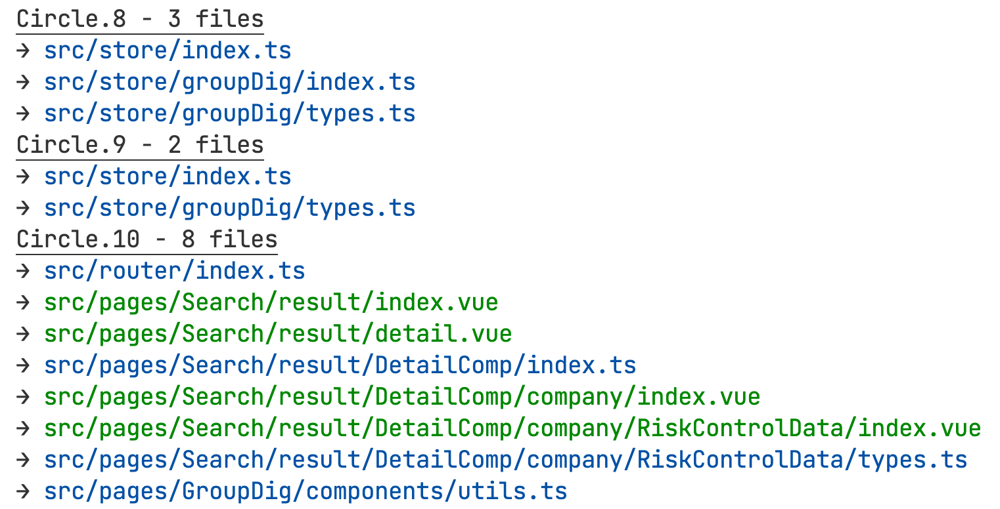

# circular dependencies scanner ⚡

<div style="display: flex;">
  <a href="https://npmjs.com/package/circular-dependency-scanner">
    
  </a>
  
  
  
  
</div>

零配置、开箱即用📦的循环依赖检测工具，提供了 JavaScript API 和命令行工具。

[English](./README.md) | 中文

# 特性

- 💡 提供命令行工具，同时具备友好的控制台输出。
- 🛠️ 提供 JavaScript API，同时具备良好的类型提示。
- 🌩 小巧、精致、快速、可靠。

# 动机

一方面 NPM 上关于循环依赖检测的工具实在太少了，另一方面，他们或多或少都有一些令人恼火的问题，无法愉快的使用。

1. 不可靠。用过的工具，没有那个能扫全的，猜测主要还是因为它们无法从多种多样的文件中类型中提取出对应的 import/require 路径。
2. 并非是独立工具。他们通常以  webpack/rollup/vite 插件形式出现，依赖宿主提供的模块关系图分析循环引用，用起来有诸多限制，也很慢。

但现在，你只需要运行 `ds`，我们用到的所有类型的脚本文件 **(.js,.jsx,.ts,.tsx,.mjs,.cjs,.vue)** 都会被 TypeScript API 快速解析，并在控制台使用彩色打印友好地输出循环引用信息。

# 命令行工具（推荐）

全局安装之后，会获得一个可执行命令 `ds`:
```sh
pnpm i -g circular-dependency-scanner # or npm/yarn
cd path/to/execute # change directory
ds # run `ds` command
```

命令行工具内置详细的文档，任何情况下都可以通过 `-h` 选项，快速打印帮助信息。

```sh
ds [options] [path] # Automatically detect circular dependencies under the current directory and print the circles.
```

## 选项

```sh
ds -h # print help info
ds -V/--version # print cli version

ds # current dir by default
ds src # detect src directory...and so on.
ds --filter 'src/router/*.ts' # only print the circles matched the pattern.
ds --absolute # print absolute path.
ds --ignore output dist node_modules # path to ignore.
ds --alias @:src @components:src/components # path alias, follows `<from>:<to>` convention
```

## Snapshot

`ts,js,vue` 文件输出时对应 `蓝色,黄色,绿色`，如下所示：



# JavaScript API

有时候你可能想手动写脚本统计分析，这时候你可以引用内部提供的方法：

```ts
import { circularDepsDetect } from 'circular-dependency-scanner';

const results = circularDepsDetect({
  /**
   * Base path to execute command.
   * @default process.cwd()
   */
  cwd: string;
  /**
   * Whether to use absolute path.
   * @default false
   */
  absolute: boolean;
  /**
   * Glob patterns to exclude from matches.
   * @default ['node_modules']
   */
  ignore: string[];
  /**
   * Path alias to resolve.
   * @default { '@': 'src' }
   */
  alias: Record<string, string>;
});

```

# 那些引用会被提取出来？

源文件在这里 [src/ast.ts](https://github.com/emosheeep/circular-dependency-scanner/blob/HEAD/src/ast.ts). 简单来说，满足以下条件的引用路径会被摘取出来：

```ts
import test from './test'; // got './test'
import './test'; // got './test'
import('./test'); // got './test'
require('./test'); // got './test'
export * from './test'; // got './test'
export { test }; // got no export source
```

如果有的环没有意义，可以通过设置 `--filter` 选项进行筛选。

# 引用

- 命令行工具基于 [commander](https://github.com/tj/commander.js).
- 循环依赖分析算法基于 [graph-cycles](https://github.com/grantila/graph-cycles).

# Issues

没有哪个工具一开始就是完美的，如果使用过程中遇到问题，欢迎提交 issue。